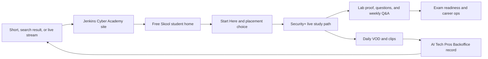

# Jenkins Cyber Academy and Skool operating playbook

**Author:** Manus AI  
**Prepared:** August 22, 2026  
**Decision horizon:** Launch through November 21, 2026

## Executive decision

Use **Skool as the learner home**, not as a second marketing site or a
replacement for the planned back-office application. The daily public stream
creates awareness and trust. The Jenkins Cyber Academy website gives a visitor
one clear next step. Skool turns a viewer into an active learner through a
course path, labs, questions, accountability, and career support. AI Tech Pros
Backoffice runs the work behind the scenes after the Day-90 validation gate.

This structure follows the business plan's central idea: the live classroom is
the engine, while the other systems increase retention, reach, and later
revenue. The current Skool group already has the right building blocks:
community posts, a classroom, calendar, leaderboards, and career-support
categories. It also already has a Security+ course. The main change is to move
that course from the advanced library into the **free, front-of-path core** and
make its lesson order match the SY0-701 objectives. [1] [2]

> **Operating rule:** One learner-facing destination, one primary call to
> action, and one source of truth for each job. Do not make a new learner choose
> between a website, chat server, course portal, and community.

## Give each asset one job

The supplied materials are valuable, but they do not all belong in front of a
student. The table below assigns each one a clear role.

| Asset | Primary job | Audience | Primary call to action or output | Keep it out of |
|---|---|---|---|---|
| **Jenkins Cyber Academy public site** | Explain the free live classroom, schedule, outcomes, and who it serves. Capture email and send qualified visitors to Skool. | New viewers, search visitors, career changers, veterans, and prospective partners. | “Join the free study community.” | Detailed lesson delivery, private student questions, and back-office operations. |
| **Twitch, YouTube, and Kick streams** | Create daily trust, teach live, answer questions, and create reusable video. | New and returning learners. | “Get today’s notes, lab brief, and weekly Q&A in Skool.” | The permanent lesson archive and student support inbox. |
| **Skool community** | Be the **student home**: onboarding, objective-by-objective lessons, lab instructions, Q&A, accountability, milestones, and career help. | Enrolled free members and future premium members. | Complete the next lesson, post proof, or attend the weekly Q&A. | A dumping ground for every VOD and every unrelated technology course. |
| **Skool Classroom** | Deliver a simple, chronological curriculum and searchable library. | Learners who need a clear next lesson. | Finish the current objective and submit the action item. | A copy of the branded source material or an exam-dump repository. |
| **Skool Calendar and community feed** | Create attendance habits, weekly rhythm, office hours, announcements, wins, and peer support. | Active members. | Attend the Q&A; publish a win, question, or lab result. | Daily duplicate event listings that make the calendar noisy. |
| **AI Tech Pros Backoffice** | Run clip production, sponsorship tracking, payouts, analytics, and staff workflows. | Henry, AI Tech Pros operators, later member educators, and brands. | Record, review, approve, publish, and measure content or deals. | Student-facing course delivery and the first 90 days of custom software work. |
| **`90days.html`, launch checklist, and first-90-days plan** | Act as the founder’s private execution dashboard and evidence log. | Founder and operator team. | Finish today’s planned work and record the proof. | A public learner-facing page. |
| **Business plan, feasibility report, and corporate records** | Guide decisions, governance, and evidence. | Founder, company operators, lenders, and professional advisers when needed. | Review results at the stated gates. | Skool downloads, public course lessons, and social media. |
| **Supplied Security+ source PDF and official objectives** | Serve as internal reference material for coverage planning only. | Curriculum author and quality reviewer. | Map each original lesson to the next objective. | Public upload, copied wording, source screenshots, logos, badges, or brand-led lesson design. |

The supplied `index.html` is an AI Tech Pros educator-backoffice landing page,
not a student acquisition page. Keep that distinction. A prospective
cybersecurity learner should land on Jenkins Cyber Academy first; a prospective
educator or brand can be sent to AI Tech Pros after the academy has proof of
results.

## The learner journey

The learner journey must be short enough to understand in one visit. The public
stream earns attention, the academy site explains the offer, and Skool makes the
next study action obvious.

The public-facing message is simple:

> **Free live cybersecurity study, hands-on practice, and career support. Join
> the study community for the lesson map, lab instructions, and live Q&A.**

Every public stream description, channel banner, short-form caption, and
website hero section must use the same destination: the Skool URL. Add an email
capture on the academy site for a weekly study-plan email, but do not create a
second discussion community. Email is the owned reminder channel; Skool is the
place where members learn and participate.

## Fix the Skool structure before the first public stream

The current group is useful, but its organization contradicts the business
model in two places. Its visible name is **Henry Jenkins Mentorship**, while the
business plan is built around **Jenkins Cyber Academy**. Also, Security+ is
currently Tier 20 in the advanced library, while the business plan makes free
Security+ live instruction the main product. A new member must not need Skool
Level 3 to reach the academy’s main course. [1] [3]

Rename the community to **Jenkins Cyber Academy | Live Study & Career Ops**.
This retains the existing career-oriented value while making the Security+
classroom clear. Use an original cover image and a short original welcome
video. The visible setup prompts for a cover image and introduction video make
these launch-critical tasks. [1]

Set the Classroom order and access as follows.

| Order | Classroom item | Access | Purpose |
|---|---|---|---|
| 1 | **Start here: choose your study path** | Open | Explains the schedule, conduct standard, original-material policy, and the two paths: foundation support or direct Security+ study. |
| 2 | **Security+ SY0-701 live study path** | Open | The academy’s core course. Put the current Tier 20 course here, rename it for clarity, and remove the Level 3 gate. |
| 3 | **Weekly labs and evidence** | Open | Holds original lab briefs, safety rules, required screenshots or written observations, and common fixes. |
| 4 | **Exam-readiness practice** | Open | Holds original scenario questions, weekly review guides, and study-planning help. Never use recalled or copied exam items. |
| 5 | **Career Ops: job search after the exam** | Open | Retains the current resume, interview, portfolio, and accountability work. |
| 6 | **Optional foundation bridge** | Open | Keeps the existing Pre-Bootcamp Prep course for beginners who need networking, operating-system, or basic IT support. It is recommended when needed, not a gate for every learner. |
| 7 | **Advanced specialty library** | Level 3 or future paid tier | Keeps the current cloud, Splunk, Terraform, Sentinel, A+, and specialty tracks without hiding the core offer. |

Use the existing **Introductions**, **Wins & Accountability**, **Resume & Job
Hunt Help**, and **Ask Henry (Q&A)** categories. Rename “General discussion” to
**Announcements and weekly guides**, and add one category named **Security+
study help**. This gives a learner a clear place to ask content questions
without turning every question into a direct message.

Keep the existing weekly Ask Henry Q&A on the Calendar. Use it as the member
retention event, not as a replacement for the weekday public stream. In the
weekly event description, list the current domain, the lab, and the question
format members should use. Each Friday, publish one recap post with the next
week’s objectives and a poll about the hardest topic.

## Build the original Security+ path in chronological order

The official objective document lists five domains in this sequence: general
security concepts; threats, vulnerabilities, and mitigations; security
architecture; security operations; and security program management and
overview. It contains 28 numbered objectives. The course must follow this
sequence even when the daily livestream changes format. [2]

The business plan describes a four-week rotation but the launch schedule starts
with Domain 1 in Week 1, Domain 2 in Week 2, and Domain 3 in Week 3. That is a
conflict with the five-domain objective structure. Resolve it before launch by
using a **five-week learning cycle**. It is clearer for learners, keeps the
objectives in order, and produces a predictable archive. If later data shows
that learners need shorter cycles, shorten individual sessions, not the
objective order. [3] [4]

| Week | Domain and objective sequence | Plain-language course promise | Required weekly proof |
|---|---|---|---|
| 1 | 1.1–1.4: controls, core concepts, safe change, and cryptography | Learn the basic words and choices security teams use to protect people, systems, and information. | Explain one security control and document a safe change plan. |
| 2 | 2.1–2.5: threat actors, attack paths, weaknesses, warning signs, and defenses | Learn who attacks, how attacks start, what evidence to look for, and how teams reduce harm. | Identify warning signs in an original scenario and recommend a defense. |
| 3 | 3.1–3.4: architecture models, secure infrastructure, data protection, and recovery | Learn how secure systems are designed, separated, protected, and restored. | Draw a simple secure design or recovery flow. |
| 4 | 4.1–4.9: secure resources, assets, vulnerability work, monitoring, hardening, identity, automation, response, and investigation data | Learn the daily operating work of keeping systems safe and responding when something goes wrong. | Complete a guided lab and write a short incident or investigation note. |
| 5 | 5.1–5.6: governance, risk, third parties, compliance, assessments, and awareness | Learn how an organization sets security rules, manages risk, checks results, and trains people. | Complete a risk note or awareness plan, then take an original cumulative review. |

Every objective page must use the current Skool lesson pattern because it is
simple and repeatable: **what you will do; why it matters; the lesson; common
mistakes; quick self-check; lab or action; and key takeaways**. The lesson body,
examples, diagrams, lab instructions, and questions must be newly written in
plain language. Use the source PDF only to verify coverage, not to supply
words, screenshots, diagrams, visuals, tables, assessments, or branding.

> **Content guardrail:** Do not upload the supplied commercial study PDF to
> Skool, link to it, reuse its images, copy its text, display its logos, or use
> its product name in learner-facing materials. Use original Academy writing and
> original visuals. Mention the certification target only when needed to explain
> the study objective, and state that the Academy is independent.

This rule gives the Academy its own voice: explain one idea, show one safe
example, give one realistic decision, and ask the learner to produce one piece
of evidence. It also avoids a course that feels like a transcript of a vendor
book.

## Daily content operating loop

One four-hour stream must create one durable lesson package rather than a loose
collection of recordings. Record each day’s package in a simple manual tracker
until the Day-90 gate; this is the product-requirements log for AI Tech Pros
Backoffice.

| Time or stage | Student-facing action | Operator record |
|---|---|---|
| Before stream | Publish a short Skool “Today’s objective” post with the question, expected outcome, and lab requirement. | Date, objective ID, lesson title, lab asset, and planned CTA. |
| Live stream | Teach the objective, answer questions, demonstrate one safe lab, and say the same Skool CTA at the start, middle, and close. | Stream URL, start and end time, concurrent-viewer trend, and useful timestamps. |
| Same-day recycle | Post the VOD link and a plain-language Skool lesson summary. Publish 3–5 clips, the planned social post, and one community prompt. | VOD link, clip links, captions, publishing status, and every call to action used. |
| Member follow-up | Answer the best questions publicly, ask for lab proof, and identify the most helpful member win. | Lesson completion signals, questions, lab posts, Q&A attendance, and common confusion. |
| Sunday review | Publish the next-week guide and review the prior week’s recurring questions. | Platform, Skool, email, conversion, coaching, affiliate, and sponsor metrics. |

The manual tracker needs only one row per stream. Its minimum columns are:
`date`, `objective`, `lesson`, `VOD URL`, `timestamps`, `clip URLs`, `Skool
lesson URL`, `CTA`, `Skool joins`, `lesson completions`, `lab posts`, `average
viewers`, `average watch time`, `email leads`, `affiliate clicks`, and
`coaching inquiries`. This is the exact kind of operational evidence the
Backoffice plan says to log before building custom software. [5]

## Use AI Tech Pros Backoffice in the right phase

Do not build a learner portal inside AI Tech Pros Backoffice before the
November 21 proof gate. The back-office plan explicitly defines Skool as the
course and community layer and positions the Backoffice as the operations layer
for VOD-to-clip workflow, sponsorship CRM, payments, analytics, and staff
operations. It also specifies a manual “member zero” period through the proof
gate. [5]

| Phase | Dates | What the Academy does | What the Backoffice does |
|---|---|---|---|
| **Phase 0: manual proof** | Now–November 21, 2026 | Run the daily class, build the Skool habit, use the manual tracker, and learn which clips and lesson formats work. | Nothing custom. Log repetitive work and failures as feature requirements. |
| **Phase 1: minimum workable back office** | December 2026–February 2027, if the gate supports it | Continue using Skool for students. Review and approve clips, organize sponsor evidence, and use measured results to shape offerings. | Build and test tenant setup, VOD ingestion, clip review, YouTube distribution, sponsorship CRM, and Stripe Connect workflow against Jenkins Cyber Academy. |
| **Phase 2: scale the operator system** | March 2027 onward | Keep the Academy as the reference school and proof case. | Add analytics aggregation, public sponsor storefront, direct short-form distribution when ready, and other educator tenants. |

The practical separation is important. **Skool helps a learner study. The
Backoffice helps the company fulfill work.** Students do not need to know about
queues, storage, payment routing, or sponsorship CRM. Sponsors and future
educators do not need access to student questions or course progress.

## Launch sequence and 90-day priorities

The launch checklist sets August 24 as the first public stream. Since the
current plan is in its final pre-launch window, complete the few changes that
remove learner confusion before producing more content. [4]

| Window | Priority | Done when |
|---|---|---|
| **August 22–23** | Rename and brand the Skool group; make the Security+ path open and first; add original cover and welcome video; rewrite Start Here and Classroom explainer; verify every public profile points to Skool; confirm the recurring Q&A. | A new learner can arrive from any stream link, understand the promise, find the open course, complete the first action, and see the next Q&A without asking for help. |
| **Launch week: August 24–28** | Teach Domain 1, publish the daily objective post, run the Packet Tracer lab, post the Friday review and Week 2 poll, and maintain the same CTA. | Five public streams, five Skool lesson summaries, one lab-proof thread, a Friday recap, and a complete manual tracker for the week. |
| **Days 1–30** | Prove the routine. Keep the community free, collect email, make the weekly Q&A useful, and learn why people join and return. | Measure 7-day activation: join, introduction, first lesson, first lab or comment, and Q&A attendance. Do not add paid Skool access yet. |
| **Days 31–60** | Add limited coaching mentions and tracked affiliate resources only where they solve a real member problem. Turn repeated questions into waitlist topics before building products. | Evidence exists for inquiry rate, clicks, questions, and demand. The community still receives dependable free instruction. |
| **Days 61–90** | Test the small study resource or other product only after demand appears; begin sponsor outreach using actual audience evidence; prepare the Day-90 review. | The manual tracker can show content output, learner engagement, retention, coaching inquiries, affiliate activity, and sponsor proof. |
| **Day 90: November 21** | Make the stated evidence-based decision. | Assess the plan’s gate: 20+ average concurrent viewers, Twitch Affiliate, a YouTube Partner application, at least two paying coaching clients, and at least one affiliate conversion. If missed, keep the teaching schedule but adjust content mix and review again as the business plan directs. [3] |

The weekly business-plan dashboard remains the executive scorecard: average
concurrent viewers, new followers or subscribers, short-form views, coaching
inquiries, sponsor outreach, affiliate clicks, and five-of-five stream
consistency. Add four Skool measures: new members, Day-7 active members, lab
proof posts, and weekly Q&A attendance. These show whether viewers are becoming
learners rather than merely watching. [3]

## What to say and what to avoid

Use the same simple language across the Academy site, Skool description, pinned
posts, and livestream. A consistent message makes the community easy to
explain to a friend, recruiter, or sponsor.

| Use | Avoid |
|---|---|
| “Free live cybersecurity study, hands-on practice, and career support.” | “A course dump,” “all-in-one portal,” or a long list of unrelated platforms. |
| “Start with the next objective. Ask questions. Post proof of your work.” | Requiring engagement points before learners can access the core Security+ path. |
| “Independent study support for the SY0-701 objective list.” | Copied vendor lesson text, logos, screen captures, badges, or claims of affiliation. |
| “Join Skool for lesson notes, labs, and the weekly Q&A.” | Sending learners to both Skool and another chat community for the same purpose. |
| “AI Tech Pros runs the operations behind the Academy.” | Presenting a future internal back-office build as a student benefit that is already live. |

## Next steps

First, make the Security+ course open and move it to the beginning of the
Skool Classroom. Second, replace the pinned welcome and classroom posts with
Jenkins Cyber Academy language and a simple first-week checklist. Third, make
one original objective-by-objective lesson template and use it for the five
launch-week lessons. Fourth, create the one-row-per-stream manual tracker.
Finally, use the public website only as a clear bridge into Skool and email,
not as a competing course platform.

This creates a clean operating stack: **public stream for discovery, Academy
site for clarity, Skool for learning and community, and AI Tech Pros Backoffice
for scalable operations once the live model has evidence.**

## References

[1]: https://www.skool.com/henry-jenkins-5224 "Henry Jenkins Mentorship Skool community, reviewed August 22, 2026"
[2]: file:///home/ubuntu/projects/jenkins-cyber-academy-fac33a95/CompTIA%20Security%2B%20SY0-701%20Exam%20Objectives%20%287.0%29.pdf "User-provided Security+ SY0-701 Exam Objectives, version 7.0"
[3]: file:///home/ubuntu/upload/Jenkins_Cyber_Academy_Business_Plan_2026-2027.docx "User-provided Jenkins Cyber Academy business plan, 2026–2027"
[4]: file:///home/ubuntu/upload/Jenkins_Cyber_Academy_Launch_Checklist_Styled.docx "User-provided Jenkins Cyber Academy launch checklist"
[5]: file:///home/ubuntu/upload/AI_Tech_Pros_Educator_Backoffice_Platform_Plan.docx "User-provided AI Tech Pros Educator Backoffice platform plan"
